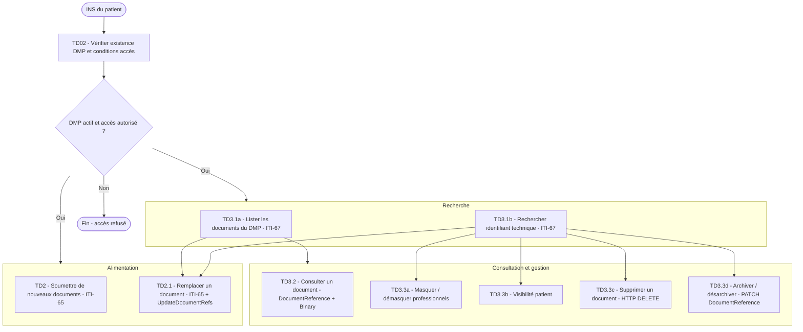

### Vue d'ensemble des transactions DMP Patient

Cette page présente une vue synthétique de l'ensemble des transactions permettant à un Logiciel de Professionnel de Santé (LPS) d'interagir avec le Système DMP dans le cadre du volet PDSM4DMP.

Les transactions sont organisées en quatre groupes fonctionnels :

| Groupe | Transactions |
|--------|-------------|
| Vérification d'accès | [TD02](transaction_td02.html) |
| Alimentation | [TD2](transaction_td2.html), [TD2.1](transaction_td2.1.html) |
| Consultation | [TD3.1a](transaction_td3.1a.html), [TD3.1b](transaction_td3.1b.html), [TD3.2](transaction_td3.2.html) |
| Gestion des attributs | [TD3.3a](transaction_td3.3a.html), [TD3.3b](transaction_td3.3b.html), [TD3.3c](transaction_td3.3c.html), [TD3.3d](transaction_td3.3d.html) |

### Diagramme de flux

### Tableau récapitulatif

| Transaction | Fonctionnalité | Équivalent FHIR/PDSm |
|-------------|---------------|----------------------|
| [TD02](transaction_td02.html) | Vérifier l'existence d'un DMP actif et les conditions d'accès | Requête `Patient?identifier` |
| [TD2](transaction_td2.html) | Alimenter le DMP avec de nouveaux documents | ITI-65 (push `DocumentReference`) |
| [TD2.1](transaction_td2.1.html) | Remplacer un document existant | ITI-65 avec `UpdateDocumentRefs` |
| [TD3.1a](transaction_td3.1a.html) | Lister les documents du DMP | ITI-67 (`DocumentReference?patient.identifier`) |
| [TD3.1b](transaction_td3.1b.html) | Rechercher l'identifiant technique d'un document | ITI-67 avec paramètre `id` |
| [TD3.2](transaction_td3.2.html) | Consulter un document | `DocumentReference` + `Binary` |
| [TD3.3a](transaction_td3.3a.html) | Masquer / démasquer un document aux professionnels | Mise à jour du consentement |
| [TD3.3b](transaction_td3.3b.html) | Rendre un document visible au patient | Mise à jour du consentement |
| [TD3.3c](transaction_td3.3c.html) | Supprimer un document | HTTP DELETE / mise à jour statut |
| [TD3.3d](transaction_td3.3d.html) | Archiver / désarchiver un document | PATCH `DocumentReference` (statut) |
