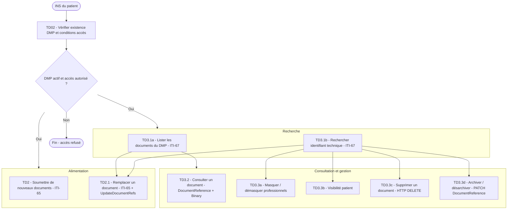

<b>Brief description of this Implementation Guide</b> 
This Implementation Guide describes how to use PDSm (FHIR-based Mobile access to Health Documents) for the French shared medical record (DMP - Dossier Médical Partagé) in the context of EEDS (European Health Data Space / Espace Européen des Données de Santé).



    <blockquote class="stu-note">
    
Cet Implementation Guide n'est pas la version courante, il s'agit de la version en intégration continue soumise à des changements fréquents uniquement destinée à suivre les travaux en cours. La version courante sera accessible via l'URL canonique suite à la première release : https://interop.esante.gouv.fr/ig/fhir/pdsm4dmp

    </blockquote>



### Introduction

Ce guide d'implémentation décrit l'utilisation du profil [PDSm (Partage de Documents de Santé en mobilité)](https://interop.esante.gouv.fr/ig/fhir/pdsm/) pour les échanges avec le Dossier Médical Partagé (DMP) dans le contexte de l'Espace Européen des Données de Santé (EEDS).

Le DMP est le carnet de santé numérique de chaque Français. Il permet aux professionnels de santé d'accéder aux documents médicaux d'un patient (comptes rendus, ordonnances, imagerie, etc.) et d'y contribuer, sous réserve du consentement du patient.

PDSm est le profil FHIR français basé sur [IHE MHD (Mobile access to Health Documents)](https://profiles.ihe.net/ITI/MHD/index.html). Il définit les transactions FHIR permettant de soumettre, rechercher et consulter des documents de santé. Ce guide précise comment ces transactions s'appliquent au contexte DMP, et documente les extensions nécessaires pour les données spécifiques au DMP qui n'ont pas d'équivalent dans MHD.

Les principales sections de ce guide sont :

* **Transactions DMP Patient et Document** : détail de chaque transaction (TD02, TD2, TD2.1, TD3.1a, TD3.1b, TD3.2, TD3.3a–d) avec leur équivalent FHIR
* **[Exemples d'usages DMP](exemples_usage_dmp.html)** : cinématiques concrètes illustrant des cas d'usage réels (ex. notification de documents tiers)
* **[Ressources de conformité](artifacts.html)** : profils, modèles logiques, mappings et exemples FHIR

### Vue d'ensemble des transactions

Les transactions sont organisées en quatre groupes fonctionnels :

| Groupe | Transactions |
|--------|-------------|
| Vérification d'accès | [TD02](transaction_td02.html) |
| Alimentation | [TD2](transaction_td2.html), [TD2.1](transaction_td2.1.html) |
| Consultation | [TD3.1a](transaction_td3.1a.html), [TD3.1b](transaction_td3.1b.html), [TD3.2](transaction_td3.2.html) |
| Gestion des attributs | [TD3.3a](transaction_td3.3a.html), [TD3.3b](transaction_td3.3b.html), [TD3.3c](transaction_td3.3c.html), [TD3.3d](transaction_td3.3d.html) |

### Périmètre

Ce guide couvre les transactions DMP réalisées par un Logiciel de Professionnel de Santé (LPS) dans le cadre du volet CI-SIS « Partage de Documents de Santé ». Il s'appuie sur le profil PDSm et le guide HL7 FHIR France (fr-core) pour le traitement de l'identité patient (INS).

### Correspondance des transactions DMP ↔ volet PDSm

**Sources :** DMPi v2.10.0 (XDS.b) · PDSm v3.1.1 (IHE MHD / FHIR R4) · IHE ITI TF Vol3 §4.2

| Opération métier | Transaction DMP | Profil IHE XDS.b sous-jacent | Transaction / flux PDSm | Mécanisme PDSm |
|---|---|---|---|---|
| Alimentation — nouveau document | TD2.1 / TD2.2 (DMP_2.1a/2.2a) | ITI-41 Provide and Register Document Set-b | ITI-65 (Flux 01) **ou** ITI-105 (Flux 09) | ITI-65 : Bundle `transaction` / ITI-105 : POST d'une seule `DocumentReference` |
| Alimentation — remplacement | TD2.1 / TD2.2 (DMP_2.1b/2.2b) | ITI-41 + association RPLC | ITI-65 (Flux 01) **ou** ITI-105 (Flux 09) | `relatesTo.code = replaces` (cardinalité `1..1` au remplacement). ITI-65 : ancienne fiche passée à `superseded` incluse dans le Bundle. ITI-105 : POST de la nouvelle fiche (`status = current`) avec `relatesTo[replaces]` ; le gestionnaire déprécie la cible |
| Recherche de documents | TD3.1 (DMP_3.1) | ITI-18 Registry Stored Query (`FindDocuments`, `GetDocuments`) | ITI-67 Find Document References | Recherche REST FHIR (`search`) sur `DocumentReference` (HTTP GET/POST) |
| Recherche de lots / classeurs | TD3.1 (`FindSubmissionSets`) | ITI-18 Registry Stored Query | ITI-66 Find Document Lists | Recherche REST FHIR sur `List` (SubmissionSet / Folder) |
| Consultation / récupération | TD3.2 (DMP_3.2) | ITI-43 Retrieve Document Set | ITI-68 Retrieve Document | Récupération du `Binary` via `attachment.url` |
| Masquer / démasquer aux professionnels | TD3.3a | ITI-57 Update DocumentEntry Metadata | Flux 03 — mise à jour des métadonnées (PATCH) | HTTP PATCH (conditional, sur identifiant métier) de `DocumentReference.securityLabel` |
| Visibilité patient / représentants légaux | TD3.3b | ITI-57 Update DocumentEntry Metadata | Flux 03 — mise à jour des métadonnées (PATCH) | HTTP PATCH de `DocumentReference.securityLabel` |
| Archiver / désarchiver | TD3.3d | ITI-57 — `availabilityStatus` = `urn:asip:ci-sis:2010:StatusType:Archived` | Flux 03 — mise à jour des métadonnées (PATCH) | HTTP PATCH de l'extension `PDSm_isArchived` (booléen) sur `DocumentReference` / `List` |
| Supprimer un document (suppression logique) | TD3.3c | ITI-57 — `availabilityStatus` = `urn:asip:ci-sis:2010:StatusType:Deleted` | Flux 03 — mise à jour des métadonnées (PATCH) | HTTP PATCH de `DocumentReference.status` → `superseded` (dépublication). Pas de suppression physique (`DELETE` absent dans MHD). RMD (ITI-62/86) **non utilisé** par le DMP |

### Dépendances



### Propriété intellectuelle


